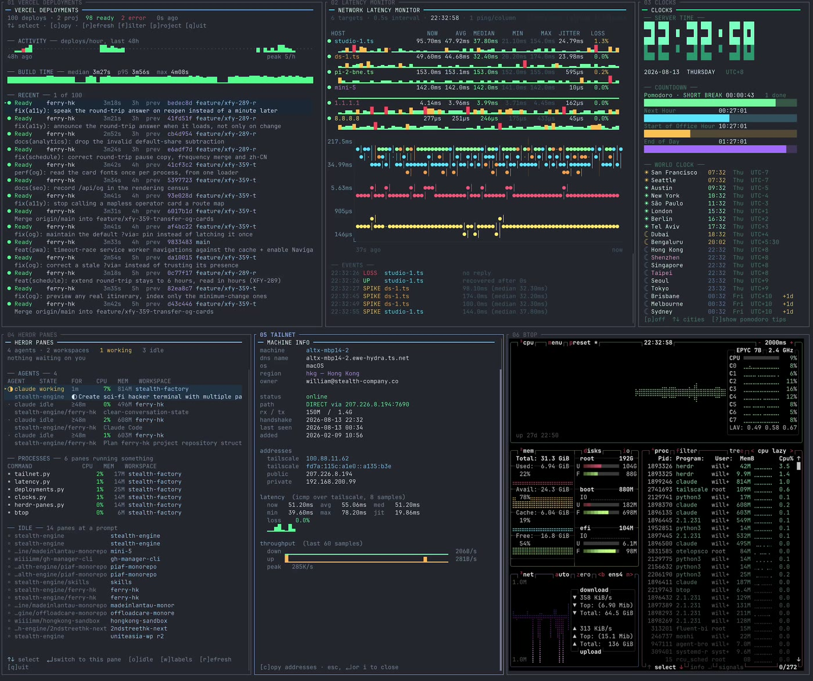

# opscope

**Hollywood called. They want their terminal back.**

*Sci-fi hacker panels from the movies — except these ones tell you the truth.*

Fill your screen with glowing panels, scrolling graphs and blinking status
readouts. The difference is that every number on them is real: actual network
latency, actual deployments, actual machines on your tailnet, actual agents
waiting on you.

[](docs/demo.mp4)

*Eight widgets running at once — every figure live. [Watch the 1m54s demo →](docs/demo.mp4)*

## Run it

**`npx opscope` is the official way to use this.** Nothing to install, no
`PATH` to manage, no version to pick — it fetches the launcher and the
binaries and starts whichever widget you name.

```sh
npx opscope              # the menu
npx opscope clocks       # or name one and skip it
```

`clocks` needs no configuration at all, so it is the one to try first.
[Other ways to get them →](#getting-them)

## The launcher

`opscope` is the front door: it shows every widget, what it does, and a
preview without starting its data source. Pick one and it runs; quit it and
you are back. It is the launcher, not another widget.

[How the launcher works →](widgets/src/launcher/README.md)

## The widgets

| Widget | What it does | Needs | Docs |
|---|---|---|---|
| **`latency`** | Continuous latency to a list of hosts: median, jitter, loss and a log-scale graph, so a slow link and an *unsteady* one look different. | `ping` · **Linux only** ([macOS →](https://github.com/stealth-factory/opscope/issues/99)) | [read →](widgets/src/widgets/latency/README.md) |
| **`vercel-deployments`** | Vercel deployments over time — activity per hour, build-time drift, and the build log of the one you open, so a failure explains itself instead of only naming a code. A copy page carries the dashboard, preview and PR URLs. | `curl`, a Vercel token | [read →](widgets/src/widgets/vercel-deployments/README.md) |
| **`tailnet`** | Tailscale peers, and whether each is reached directly or through a relay. Live throughput, full machine info, copyable addresses. | `tailscale` | [read →](widgets/src/widgets/tailnet/README.md) |
| **`herdr-panes`** | Every agent and process across all workspaces, ordered by which one needs a human. Enter jumps you there. | `herdr` | [read →](widgets/src/widgets/herdr-panes/README.md) |
| **`github`** | Pull requests across every org: merge rate, opened-vs-merged per day, review backlog and the contribution calendar — and `↵` for one account on a screen of its own, because a queue growing in one of them is invisible in a total the others are also feeding. | `curl`, a GitHub token | [read →](widgets/src/widgets/github/README.md) |
| **`github-actions`** | GitHub Actions across your personal account and orgs: what is running or queued, which workflows are failing repeatedly, which job and step broke, and whether the pipeline is getting slower. | `curl`, a GitHub token | [read →](widgets/src/widgets/github-actions/README.md) |
| **`github-prs`** | The pull requests you have to follow up on: checks, reviews, mergeability, and a stack map with the order a stack has to merge in. | `curl`, a GitHub token | [read →](widgets/src/widgets/github-prs/README.md) |
| **`linear`** | Linear across every team: what is outstanding, the running cycles and their scope creep, issues created against completed, and every project still going. `↵` opens a cycle, a team or a project on a screen of its own. | `curl`, a Linear API key | [read →](widgets/src/widgets/linear/README.md) |
| **`agent-usage`** | How much each coding agent on the machine has been used — tokens, sessions, AI-written code — and what is left of each one's rate limit, one tab per agent. | the agents' own logins | [read →](widgets/src/widgets/agent-usage/README.md) |
| **`ports`** | What is listening on this machine — the dev servers you have running, which project each was started from, how long it has been up, how much traffic it is carrying, and whether anything outside the box can reach it. `k` stops the selected one; `↵` opens it for a traffic chart, an address to copy, or a publish over Tailscale or Cloudflare. | `ss` for the traffic · Linux, macOS | [read →](widgets/src/widgets/ports/README.md) |
| **`netwatch`** | Which processes are using the network — total since it started, current rate, up and down, per process — read from the kernel's own per-socket counters rather than by capturing packets. | `ss` · **Linux only** ([macOS →](https://github.com/stealth-factory/opscope/issues/100)) | [read →](widgets/src/widgets/netwatch/README.md) |
| **`link`** | How good the connection is between this machine and whoever is connected to it — round-trip time, jitter, loss and achieved rate for every inbound session, read from the kernel rather than probed. | `ss` · **Linux only** ([macOS →](https://github.com/stealth-factory/opscope/issues/101)) | [read →](widgets/src/widgets/link/README.md) |
| **`clocks`** | Server clock, countdowns to the next hour / end of office hours / end of day, a pomodoro, and a world clock. | — | [read →](widgets/src/widgets/clocks/README.md) |
| **`matrix`** | Nothing whatsoever. Digital rain, with truecolor fade trails. | — | [read →](widgets/src/widgets/matrix/README.md) |
| **`months`** | A month grid you can page through: today marked, at least two weeks of context either side of it, ISO week numbers, and the zone the dates are reckoned in — `clocks` owns the time of day, this owns dates. | — | [read →](widgets/src/widgets/months/README.md) |

**Three are Linux-only today.** `latency`, `netwatch` and `link` read the
kernel through `/proc` and through `ss`, neither of which exists on macOS;
each links the issue tracking its port above. The other twelve run on Linux
and macOS alike. Nothing here works on Windows.

Each is a single self-contained binary — every library it needs is compiled
in, `ldd` shows only libc, libm and libgcc, and there is nothing to install
alongside it. 24-bit colour, and a full redraw each frame so everything
reflows when you resize the pane.

## How it started

Literally: *"split 10 panels that make my computer look like some sci-fi hacker
terminal from the movies."*

So there were ten. A radar sweep, a rotating globe, a spectrum analyser, a
cipher cracker, a memory scanner, a packet intercept — all beautiful, all
fabricated. They looked exactly right and told you nothing.

Then one got wired to `/proc` and became genuinely useful, and the contrast was
impossible to unsee. One by one the fakes came down, each replaced by something
that answers a real question. What survived is the aesthetic with the lying
removed.

Some of the theatre is still here, unapologetically. `matrix` computes
nothing at all — it just looks good, and it knows it.

## Getting them

**The official route is `npx`.** If you have Node, this is the whole thing:

```sh
npx opscope                 # the menu
npx opscope clocks          # skip the menu; any widget name works
npx opscope@latest clocks   # latest release, or pin with @0.3.0
```

It fetches the launcher and fifteen widget binaries for this machine into
npm's cache and runs whichever you named — or the menu, if you named none.
**Your `PATH` is not touched.** Only `opscope` is exposed as a command; the
widgets sit inside the package beside it, which is why `link` never shadows
the coreutils command of that name.

Published for Linux x86-64 (glibc 2.35 or newer), macOS Apple Silicon and
macOS Intel.

There is no Homebrew formula yet. You can also download three files, or
build all sixteen binaries. Both take about a minute.

### Download a release

Linux x86-64, macOS Apple Silicon and macOS Intel are built for every tag.
This works out which one you want, checks it against its own checksum, and
unpacks it — no version to fill in, because it asks which release is
current:

```sh
R=https://github.com/stealth-factory/opscope/releases
V=$(curl -fsSLI -o /dev/null -w '%{url_effective}' $R/latest | sed 's|.*/||')
case "$(uname -s) $(uname -m)" in
  "Darwin arm64")   A=aarch64-apple-darwin ;;
  "Darwin x86_64")  A=x86_64-apple-darwin ;;
  "Linux x86_64")   A=x86_64-unknown-linux-gnu ;;
  *) echo "no build for $(uname -sm); build from source below" >&2 ;;
esac
T=opscope-$V-$A
curl -fsSLO $R/download/$V/$T.tar.gz
curl -fsSLO $R/download/$V/$T.tar.gz.sha256
shasum -a 256 -c $T.tar.gz.sha256    # sha256sum -c on Linux; either is fine
tar -xzf $T.tar.gz && cd $T
```

Or take them by hand from the
[latest release](https://github.com/stealth-factory/opscope/releases/latest)
— every tarball has a `.sha256` beside it.

The sixteen binaries are right there, beside `config.example.json` and a
copy of the docs. Nothing else is needed to run them, so this folder can
live wherever you like. Start them from it — do not copy `link` onto your
`PATH`, it shadows the coreutils command of that name:

```sh
./opscope            # the menu
./opscope link       # skip the menu
./opscope clocks -h  # widget flags go through
```

**On macOS, download with `curl` rather than a browser.** These binaries are
not signed or notarised, and a browser marks what it downloads with
`com.apple.quarantine`, which makes Gatekeeper refuse to run them. `curl`
does not set that mark. If you did use a browser, clear it:

```sh
xattr -d com.apple.quarantine ./*
```

*(Written from how Gatekeeper is documented to behave — this repo has no Mac
to check it on. If it is wrong, that is worth an issue.)*

### Or build them

Needs a Rust toolchain and nothing else:

```sh
cargo build --release   # launcher + fifteen widgets in ./target/release
./target/release/opscope # the menu, from the build tree
```

## Running them

`opscope` is the front door — a menu of the fifteen widgets, with a live preview of
whichever is highlighted. Name a widget to skip the menu. The same shape
works from `npx`, from an unpacked tarball, and from a build tree:

```sh
npx opscope              # pick one and it runs
npx opscope clocks       # or name one and skip the menu
npx opscope clocks -h    # flags after the name belong to the widget
```

The launcher looks for each widget beside itself, so the launcher and fifteen
widget binaries have to stay together — `npx` keeps them that way for you.
An unpacked tarball or a build tree is a setup method, not the usual way to
run them, and lives under
[Getting them](#getting-them).

They are built to sit side by side, but nothing assumes a multiplexer — each
is an ordinary terminal program. Tile them however you like, and they degrade
rather than break as panes get narrower: columns drop out in priority order,
footers wrap instead of truncating, and graphs rescale. A widget in a
30-column strip still says something useful.

### Scrolling

Every widget scrolls, and they all scroll the same way.

| | |
|---|---|
| `wheel` | **full widget scroll** — the whole pane moves under a pinned title |
| `Ctrl-Y` `Ctrl-E` | the same thing from the keyboard, a line at a time, as in vim |
| `↑` `↓` | move the **selection**, and the view follows to keep it in sight |

The split is the point: **the mouse moves the view, the keys move the
selection.** Turning the wheel never changes which row is selected — not even
when it scrolls that row off the screen — and never changes which section has
focus. So scrolling to look at something cannot change what `↵` opens. Press
an arrow and the window comes back to the cursor.

Nothing is ever hidden because a pane is short. Each widget builds its frame
at whatever height it needs and the pane shows a window onto it, so a section
that will not fit is *below the fold* rather than dropped — a chart that is
not drawn looks exactly like a chart with no data, and only one of those is
your problem to fix.

Mouse reporting is on by default and takes drag-to-select away from the
terminal while it is. `"terminal": {"mouse": false}` in your config turns it
off; the keys are unaffected. See [Configuration](#configuration).

## Configuration

Every widget reads optional settings from the first readable of
`$OPSCOPE_CONFIG`, `$XDG_CONFIG_HOME/opscope/config.json`
(`~/.config/opscope/config.json` where that is unset), `config.json` in
the working directory, and `config.json` beside the binary.

**Nothing has to be configured.** Every key is optional, and a key you leave
out is not a gap — the widget uses the default built into it. Five widgets
need a token before they can show you something; they are named under
Credentials below. Every other widget starts on its own defaults.

There are two ways in, and they write the same file.

### The settings screen

Press `,` in any configurable widget, or in the launcher for the settings
every widget shares. It is one screen, owned by `opscope-core` rather than
written fifteen times, so it behaves the same everywhere.

The list shows every key that widget answers to, and for each one the value
in force, the default it falls back to, and what the key means. The file
being written is named at the top, so there is never a question of which
`config.json` you are editing.

`↵` opens the row under the cursor, and what opens depends on the value:

| the value | what `↵` opens |
|---|---|
| text, or a number | a single-line editor |
| true / false | nothing — it moves the value on, default included |
| one of a fixed set | the choices, one to a row |
| a list of names, or of numbers | an entry-at-a-time editor: type to add one, pick one to remove it |
| a group of named settings | the same, one entry per group, each opening its own screen |
| a model's prices | a searchable card of every model, its publisher and its rates |

The editors that both take typing *and* hold a list keep the two apart: you
are typing until `tab` or `↓`, and picking after. It is why `d` puts a `d` in
the box rather than deleting the entry you can see — the box has focus, and a
key that means two things at once will eventually do the wrong one.

`[d]efault` on a row **removes** the key from your `config.json` rather than
writing today's default into it, so the widget's own default goes on being
the answer even when a later release changes it.

Writes are atomic and owner-only. **The widget reloads itself as you leave
the screen**, so nothing needs restarting.

### Editing `config.json` by hand

[`config.example.json`](config.example.json) is the reference, and it is
**generated** — not written by hand, not kept current by remembering to. It
is built from the same per-widget declarations the settings screen reads, so
it carries every section, every key any widget reads, that key's real
default, and a comment for each saying what it does:

```json
"ports": {
  "_system_ports_comment": "Extra ports to hide behind `o`, which hides them by default. …",
  "system_ports": [22, 53, 123, 323, 631, 5353],
  "_refresh_comment": "Seconds between listening-socket and traffic refreshes.",
  "refresh": 4.0
}
```

Copy the sections you want, drop the rest. `_comment` keys are ignored, so
they can stay where they are as a reminder.

**So you do not have to read fifteen widget pages to find out what you can
set.** `cargo test` fails if a widget reads a key the example does not list,
and fails again if the example lists a key no widget reads — the file is
neither incomplete nor stale by construction, in both directions. The
per-widget pages are for depth: where a number comes from, what it means, why
a default is what it is. They are not the inventory.

Section names are the widget's name with hyphens turned to underscores, so
`vercel-deployments` reads `vercel_deployments`. **Getting one wrong is
silent** — a section no widget reads is simply never read, and the widget
goes on using its defaults as though you had written nothing.

`terminal` is the one section that is not a widget's. It applies to all of
them, and `,` in the launcher edits it:

```json
"terminal": { "mouse": false }
```

turns off mouse reporting, which is what makes the scroll wheel scroll a
widget. It is on by default and costs a real thing while it is: with the
terminal reporting, dragging selects nothing, so copying a line off a panel
with the mouse stops working. Turn it off if you copy more often than you
scroll — `Ctrl-Y` and `Ctrl-E` still scroll either way, and so do the arrows.

### Credentials

**Five widgets define their own token settings:** `vercel-deployments` wants
a Vercel token from Account Settings → Tokens, `github` a *classic* GitHub
PAT with `repo` and `read:org` (fine-grained tokens reach only one org each),
`linear` a personal API key from Settings → Security & access, and
`github-prs` and `github-actions` each hold their own GitHub token rather
than borrowing one. Every other widget needs no configuration to start.

Keeping all of this in `config.json` is what keeps hostnames, ping targets,
city lists and tokens out of the source tree: the repo ships generic
defaults, and `config.json` is git-ignored along with `.env` files and
anything else likely to hold a secret.

### Asking an assistant to configure one

Each binary carries a plain-Markdown guide for an AI assistant helping you:

```sh
opscope latency --configure-help
```

The guide explains real data sources, safe inspection, credentials, and what
must be asked rather than guessed. It is documentation, not a skill and not
permission to make changes.

## Requirements

- **Nothing to install to run them** — the binaries carry what they link
  against, SQLite included. Node, if you use `npx`; a Rust toolchain only
  if you build rather than download or install
- Linux x86-64 or macOS, Apple Silicon or Intel. A Linux arm64 build is not
  produced yet; that machine builds from source
- A terminal with 24-bit colour
- Per-widget, the external *tools* the table above names: `curl`, `ss`,
  `ping`, `tailscale`, `herdr`. Each widget needs only its own; one that
  cannot work without its tool says so rather than drawing an empty pane; and
  **none needs root**

## Documentation

Every widget has a page of its own — what it shows, where each number comes
from, every key it answers to, and the settings it reads when it is
configurable. That README lives beside the widget's code, help,
plain-Markdown AI configuration guide, and — when the widget has settings —
its settings declaration. They are linked from the table above and indexed in
[`docs/`](docs/README.md).

Seven pages are about the repository rather than a widget:

| | |
|---|---|
| [Making a widget](wiki/making-a-widget.md) | how one folder owns a widget's code, help, preview, settings and AI configuration guide — and everything else it takes to add one |
| [Model prices](wiki/model-prices.md) | published API list prices per million tokens, with sources and as-of dates |
| [Design conventions](docs/design.md) | the rules every widget holds to, and why each was paid for |
| [Internals](docs/internals.md) | `opscope-core`, the chart helpers, and what `cargo test` checks that a compiler cannot |
| [Port decisions](docs/port-decisions.md) | what the Rust port changed from the Python and why — the answer to most questions beginning *why does this key do that* |
| [Building Herdr panels](docs/building-herdr-panels.md) | resize semantics, focus, and the layout mistakes worth skipping |
| [Releasing](docs/releasing.md) | how a version is decided, what merging the release PR sets off, and what to do when it goes wrong |

## Bundled skill

[`skills/herdr/`](skills/herdr/) carries the Herdr control skill, so an agent
working in this repo can drive panes, tabs and workspaces without going looking
for it — copy it to `~/.claude/skills/herdr/` to install. It is Herdr's own
file, not covered by this repository's licence, and `herdr --skill` regenerates
it after an upgrade.

## What is being worked on

Planned widgets, open questions and the state of the Rust port are tracked
in Linear: <https://linear.app/stealth-company/project/opscope-e829b47d84b8/issues>. The link needs access to the workspace; the issues are the
canonical list either way, so a feature that looks missing may already be
filed there with a reason.

## Contributing

`cargo test` from the root is the gate: each widget's own tests, plus
[`widgets/tests/check.rs`](widgets/tests/check.rs), which reads the sources
and fails on the things a compiler cannot see — a poller that dies without
saying why, a key hinted but unanswered, a setting read but undocumented, a
colour below WCAG AA on a selected row. [Internals](docs/internals.md)
explains what each check is defending.

## License

[GNU AGPL-3.0](LICENSE). You may use, modify and share these widgets freely; if
you distribute a modified version — or run one as a network service — you must
make your source available under the same license. Commercial licenses are
available; write to [email@wiiiimm.codes](mailto:email@wiiiimm.codes).
